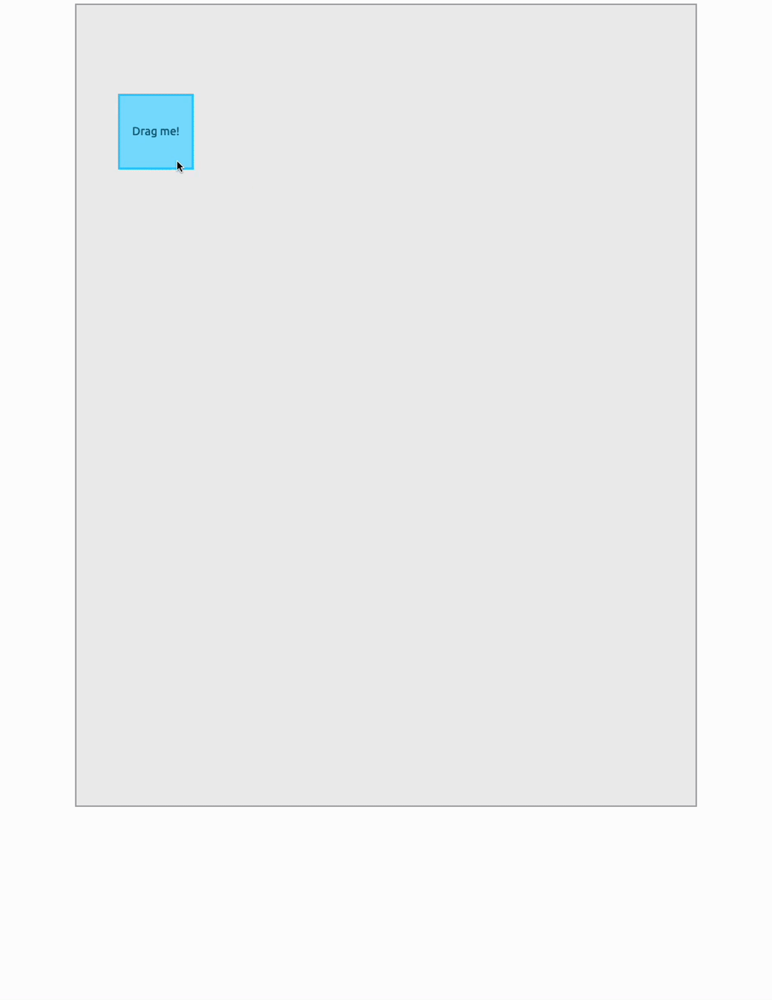

# Div in Div

[](https://github.com/shivan-s/div-in-div/actions/workflows/pages/pages-build-deployment)

<https://shivan-s.github.io/div-in-div> - [LIVE LINK](https://shivan-s.github.io/div-in-div)

Here is an example of take home problem.

## Demo



## How to use

Clone the repo:

```
git clone https://github.com/shivan-s/div-in-div

```

The file is simple html/css and vanilla js and should run directly in the browser, but I like to use `live-server`.

```
npm i -g live-server
cd div-in-div
live-server .

```
